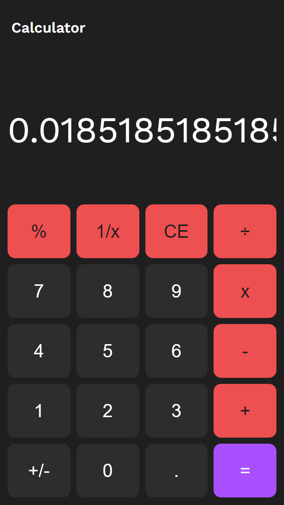
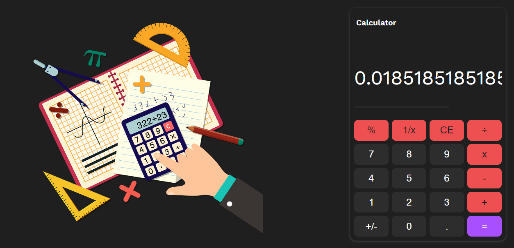

# Calculator

It is a mini version of a mathematical calculator. It implements a handful of operations such as `modulo`,` 1/x fraction`, `addition`, `subtraction`, `division` & `multiplication`. It can recall the previous calculation result and use it as input for the following calculation.

## Designs

<table>
  <tr>
    <th>Mobile</th>
    <th>Desktop</th>
  </tr>
  <tr>
    <td></td>
    <td></td>
  </tr>
</table>

## 🛠️ Built With

## ✍️ Authors

👤 **Steven Ntakirutimana**

- GitHub: [@sntakirutimana72](https://github.com/sntakirutimana72)

## 🤝 Contributing

Contributions, issues, and feature requests are welcome!

Feel free to check the [issues page](../../issues/).

## 🫶 Show your support

Give a ⭐️ if you like this project!

## 🤓 Acknowledgments

- The `Odin Project`

## 📝 License

This project is [MIT](./LICENSE) licensed.

